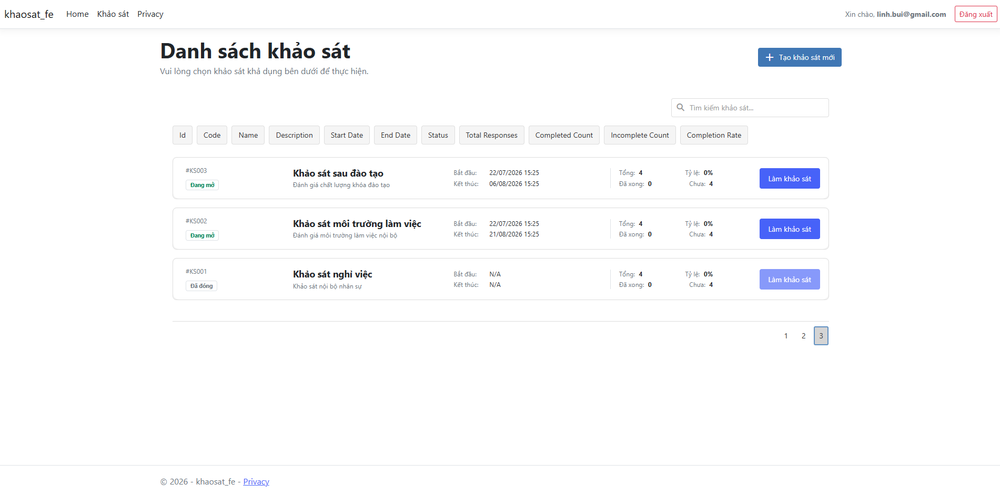
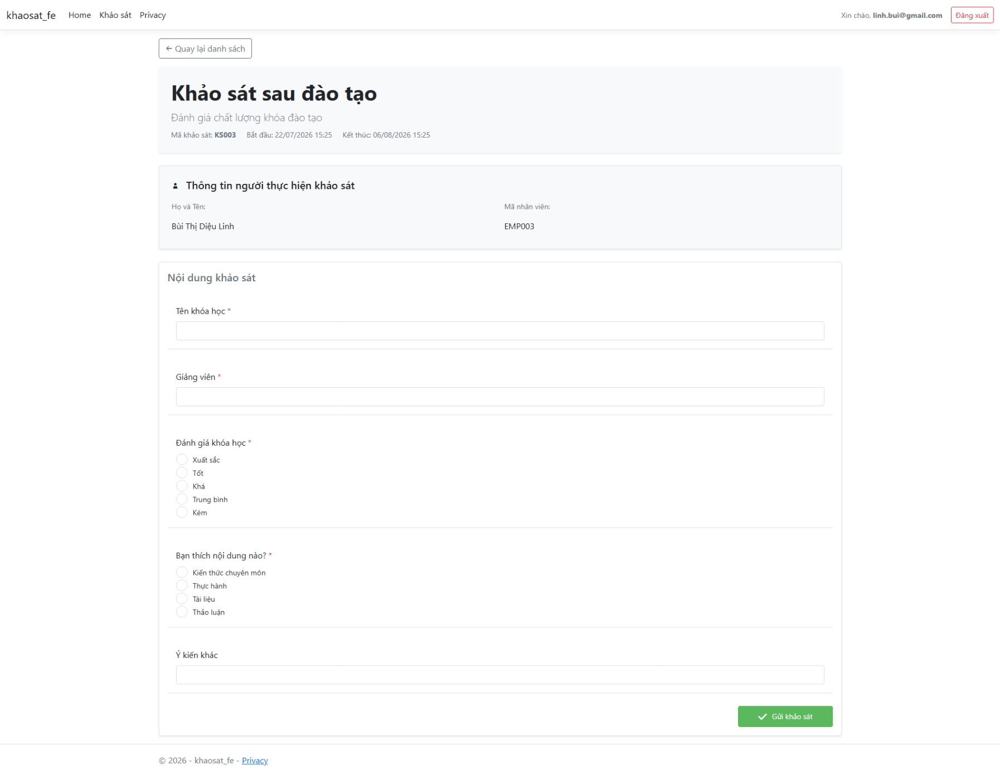
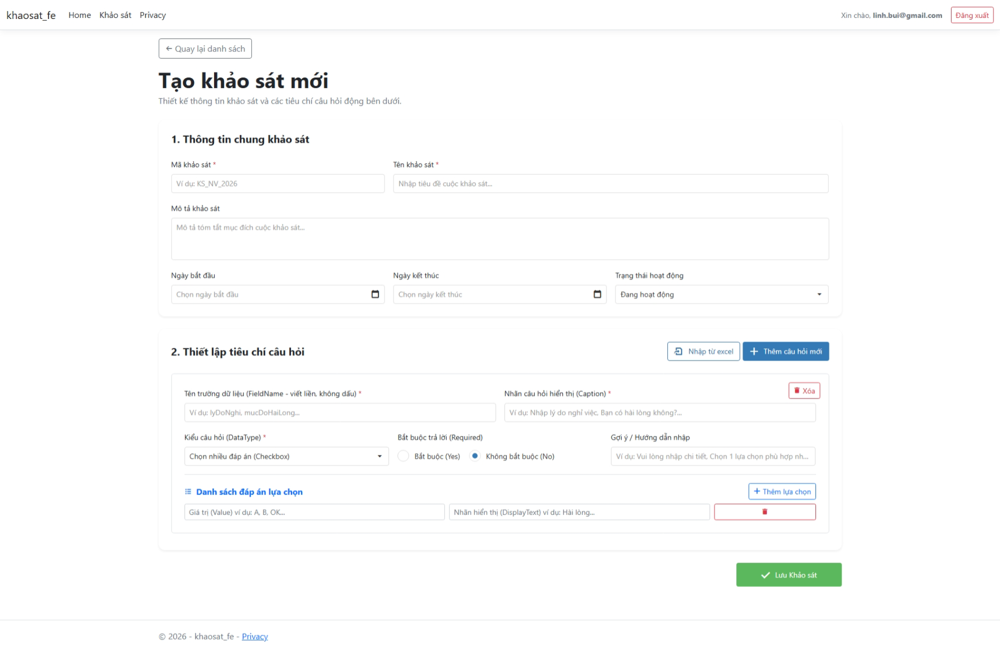
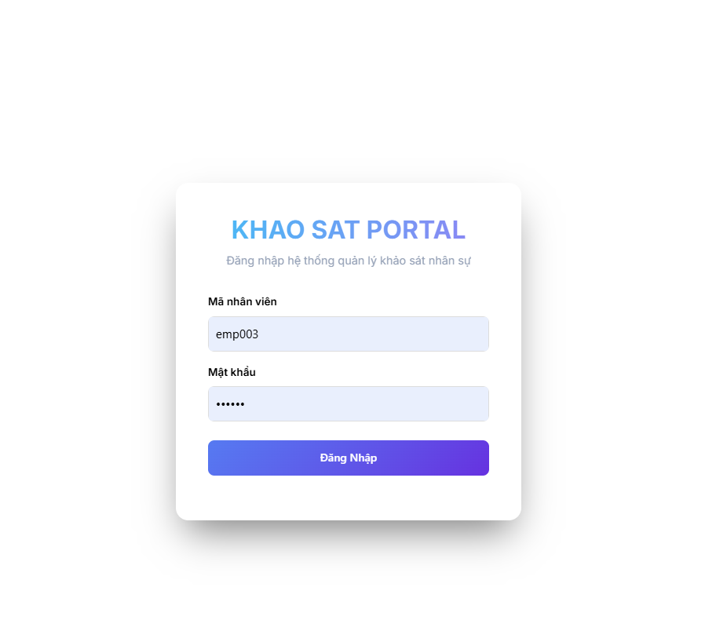

# Quản Lý Khảo Sát

---
## 🛠️ Công Nghệ Sử Dụng
* **Backend:** ASP.NET Core Web API (C#) & SQL Server
* **Frontend:** ASP.NET Core Web MVC, Bootstrap, DevExtreme, jQuery

---

## 🚀 Cách Chạy Dự Án

1. **Chạy Backend:** Mở thư mục `khaosat_api/khaosat_api` và chạy lệnh:
   ```bash
   dotnet run
   ```
2. **Chạy Frontend:** Mở thư mục `khaosat_fe/khaosat_fe` và chạy lệnh:
   ```bash
   dotnet run
   ```

---

## 📸 Demo UI

* **Danh sách khảo sát:**
  

* **Chi tiết khảo sát:**
  

* **Tạo khảo sát mới:**
  

* **Đăng nhập:**
  
